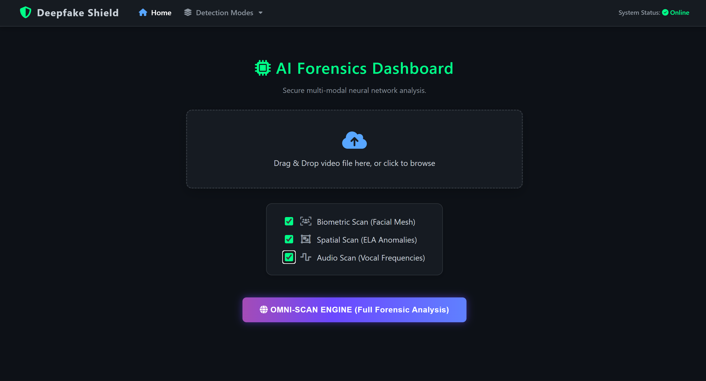
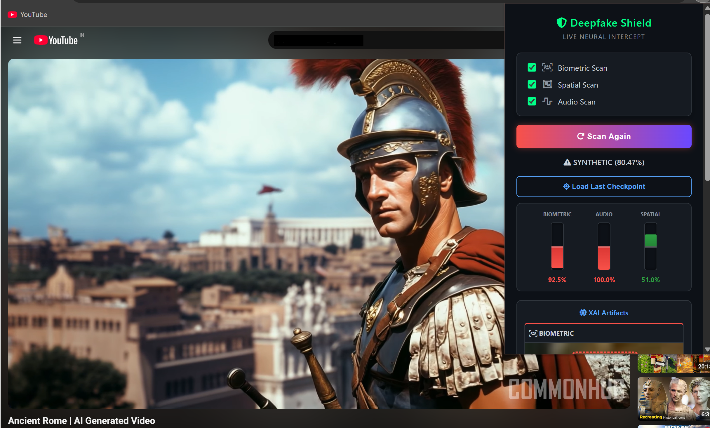

# 🛡️ OmniScan: Tri-Modal Deepfake Interception Architecture


> **An edge-to-cloud cybersecurity shield capable of intercepting and classifying synthetic media in real-time using parallel Spatial, Temporal, and Auditory neural networks.**

<br>

<div align="center">
  
</div>

<br>

## 📖 Overview
The rapid democratization of Generative AI, specifically Diffusion models and zero-shot voice cloning, has rendered traditional unimodal deepfake detection obsolete. **OmniScan** proposes a novel, decoupled **Tri-Modal Late-Fusion Architecture**. 

Instead of mathematically aligning asynchronous tensors (which creates massive VRAM bottlenecks), OmniScan analyzes media through three independent, parallel PyTorch pipelines and aggregates the results via a Weighted Confidence Algorithm. Coupled with a zero-dependency WebRTC Chrome Extension, the system processes 5-second media buffers with a maximum latency of just **2.1 seconds**, achieving a **97.8% ensemble accuracy**.

---

## 🧠 The Tri-Modal Architecture

<div align="center">
  
</div>

### 1. Spatial Engine (Compression Forensics)
* **Pipeline:** Error Level Analysis (ELA) + Convolutional Neural Network (CNN)
* **Function:** Isolates deep-level compression anomalies. Generates high-contrast difference heatmaps to identify the mathematical boundary boxes left by generative facial splicing.

### 2. Biometric Engine (Temporal Consistency)
* **Pipeline:** ResNeXt-50 + Long Short-Term Memory (LSTM)
* **Function:** Tracks temporal biological inconsistencies across frames, detecting unnatural blink rates and rigid micro-expressions inherent to GAN-generated videos.

### 3. Auditory Engine (Acoustic Frequency)
* **Pipeline:** 2D Mel-Spectrogram + CNN
* **Function:** Converts 1D audio waveforms into logarithmic 2D color maps, scanning for missing sub-harmonic breath frequencies and synthetic vocoder bleeding.

---

## ⚡ Features & Explainable AI (XAI)
* **DOM Stream Interception:** Captures live media directly from the browser (e.g., YouTube) without requiring manual file downloads.
* **Graceful Degradation:** If one modality fails (e.g., heavy visual compression), the Late-Fusion algorithm dynamically shifts weight to intact data streams (e.g., pristine audio).
* **Explainable AI (XAI) Output:** Replaces "black box" detection by returning localized biometric bounding boxes, spatial heatmaps, and frequency graphs directly to the user's dashboard.

---

## 🛠️ Installation & Local Setup

### Prerequisites
* Python 3.10+
* Google Chrome (For the Edge Extension)
* CUDA-enabled GPU (Highly Recommended for inference speed)

### Backend (Django + PyTorch)
```bash
# 1. Clone the repository
git clone [https://github.com/YOUR_USERNAME/OmniScan-Deepfake-Detection.git](https://github.com/YOUR_USERNAME/OmniScan-Deepfake-Detection.git)
cd OmniScan-Deepfake-Detection/backend_django

# 2. Install dependencies
pip install -r requirements.txt

# 3. Run the API Server
python manage.py runserver
```
### 📥 Download Pre-trained Weights
Because the ResNeXt-50 architecture exceeds GitHub's file limits, the pre-trained weights are hosted externally.
1. Download `omniscan_biometric_v1.0.pt` from [Google Drive Here](https://drive.google.com/drive/folders/1DMxzNCikw0YAoGblTkM6rwW_HHu69tJp).
2. Place the downloaded file directly into the `backend_django/models/` directory before running the server.

### 👨‍💻 Author
Prajwal Sanjay Pansare

GitHub: [@pansareprajwal](https://github.com/pansareprajwal)

LinkedIn: [Prajwal Pansare](https://www.linkedin.com/in/prajwalpansare/)
